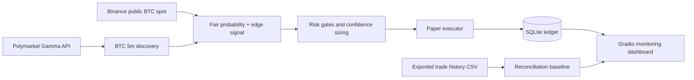

# Crypto Trading Ops Demo

Local, interview-ready demo of a BTC 5-minute paper-trading control plane. It is built to show systematic trading judgment: market discovery, signal generation, confidence sizing, risk gates, trade lifecycle logging, reconciliation, and shift-friendly monitoring.

This is not a production trading bot and it does not place real orders.

## Why This Exists

The project is optimized for crypto quant trading and trading-operations interviews. It demonstrates:

- **Trading algorithm analysis:** fair-value probability from BTC spot move, short-horizon volatility, and Polymarket implied prices.
- **Parameter/configuration discipline:** confidence thresholds, sizing bands, target/stop/time exits, and feed freshness assumptions are env-configurable.
- **Trade lifecycle support:** every paper tick, entry, exit, exit reason, confidence, notional, and PnL is persisted in SQLite.
- **Risk and collateral awareness:** `$1-$5` paper sizing by confidence, one position per 5-minute window, forced paper flatten on Stop, no live key path in paper mode.
- **Monitoring and shift coverage:** Gradio dashboard refreshes BTC status every 5 seconds and exposes latest signal, feed source, risk state, open exposure, PnL, and recent paper trades.

## Demo Flow

```bash
source .venv/bin/activate
python main.py
```

Open `http://127.0.0.1:7860`.

Suggested interview path:

1. Open **Interview Brief** to explain the system in trading-ops terms.
2. Open **BTC 5m** and press **Start BTC bot**.
3. Watch live market discovery, signal state, risk state, and paper ledger update.
4. Press **Stop BTC bot** to demonstrate the kill switch and forced paper flattening.
5. Use SQLite or `tools/demo_snapshot.py` to show persisted state.

## Active Scope

- **BTC 5m paper trader:** role-relevant demo path. Discovers `btc-updown-5m-*`, reads live Polymarket Up/Down prices, uses Binance public spot as a paper-mode fallback while Chainlink Data Streams access is pending, and records simulated trades.
- **Weather research tab:** retained as a separate research/analysis example. It is manual-only and not part of the BTC paper executor.
- **Portfolio/performance tabs:** read-only monitoring and calibration examples.

## Environment

```bash
HF_TOKEN=hf_xxx
MY_POLYMARKET_PROXY_ADDRESS=0xYourProxyAddress
DATA_DIR=./data
DB_PATH=./data/polymarket_local.db
DASHBOARD_SERVER_NAME=127.0.0.1
DASHBOARD_SERVER_PORT=7860

BTC_BOT_MODE=paper
BTC_PAPER_MIN_TRADE_USD=1
BTC_PAPER_MAX_TRADE_USD=5
BTC_PAPER_TICK_SECONDS=5
BTC_PAPER_ENTRY_EDGE_MIN=0.045
BTC_PAPER_MIN_CONFIDENCE=0.62
BTC_HISTORY_CSV_PATH=~/Downloads/Polymarket-History-2026-04-30.csv
```

`HF_TOKEN` is only needed for LLM-narrated weather analysis. BTC paper trading does not need private keys.

## Architecture



## Files To Review

- `btc_bot/paper.py` - BTC paper strategy loop, market discovery, signal, paper entry/exit, and metrics.
- `btc_bot/controller.py` - Start/Stop orchestration and kill switch.
- `btc_bot/history.py` - exported Polymarket history baseline for sizing/reconciliation context.
- `dashboard.py` - Gradio control plane and interview/demo UI.
- `db.py` - SQLite schema for recommendations, feed, BTC ticks, and paper positions.
- `docs/INTERVIEW_DEMO.md` - concise interviewer-facing walkthrough.
- `docs/OPERATIONS_RUNBOOK.md` - monitoring checklist and incident handling.
- `tools/demo_snapshot.py` - CLI snapshot of current BTC paper state.

## Safety

- Paper mode only by default.
- `.env`, `data/`, SQLite files, archives, and local IDE files are gitignored.
- No private key is required or displayed for the demo.
- Chainlink Data Streams is the intended production-quality BTC reference, but this demo clearly labels Binance public spot as the paper fallback.
