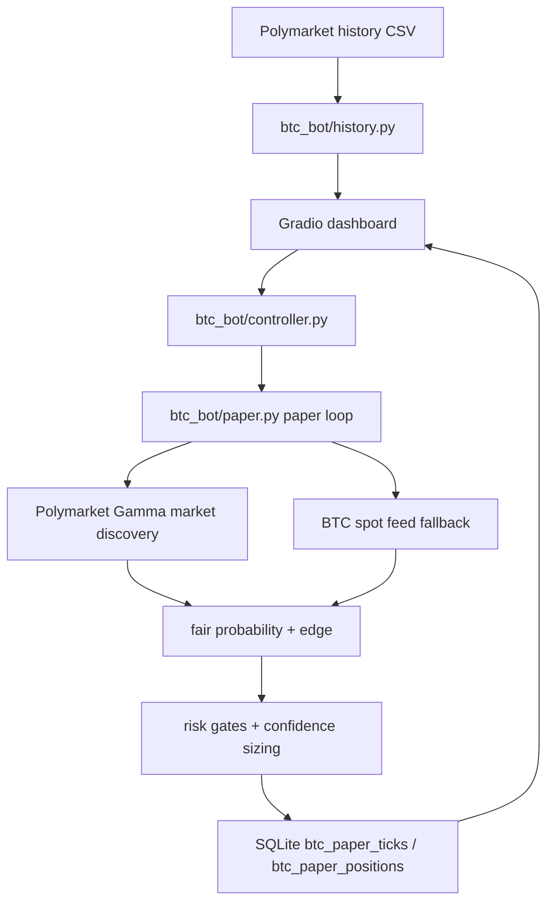

# Architecture

## Components

- `dashboard.py` is the operator control plane. It exposes the interview brief, BTC paper controls, risk state, latest signal, feed source, ledger summaries, and research side tabs.
- `btc_bot/controller.py` owns Start/Stop semantics and prevents paper/live concerns from mixing.
- `btc_bot/paper.py` owns market discovery, spot sampling, fair probability, signal decisions, simulated entry/exit, paper PnL, and summary metrics.
- `btc_bot/history.py` summarizes exported Polymarket history so paper sizing can be explained against actual manual behavior.
- `db.py` creates the SQLite tables used by both research and BTC paper trading.

## Design Choices

- Paper mode is the only executable trading path.
- Live execution would be a new adapter, not a modification of the paper ledger.
- Feed source is surfaced in UI so an operator can distinguish fallback data from the intended Chainlink Streams path.
- Every decision has a reason string so monitoring and reconciliation are explainable.
