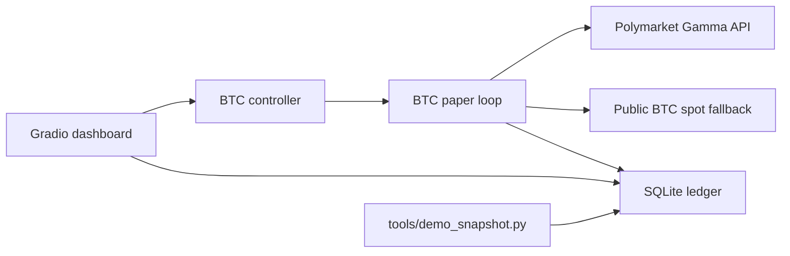

# Architecture

The app is deliberately small:

## Boundaries

- `dashboard.py` owns the local operator interface.
- `btc_bot/controller.py` owns Start/Stop and kill-switch behavior.
- `btc_bot/paper.py` owns market discovery, signal generation, simulated
  entries, exits, and paper ledger writes.
- `db.py` owns SQLite schema, config state, and activity notifications.
- `btc_bot/history.py` reads the optional exported BTC history CSV.

## Data Flow

1. Dashboard calls Start.
2. Controller starts a background paper loop.
3. Paper loop discovers the current BTC 5-minute market.
4. Paper loop fetches public BTC spot data.
5. Paper loop records a tick in SQLite.
6. If edge and confidence pass thresholds, the loop opens one simulated
   position.
7. The loop exits positions by target, stop, time, market rollover, or Stop.

## Live Trading

Live trading is intentionally absent. Adding it should be a separate reviewed
change with key isolation, order acknowledgement/fill tracking, reconciliation,
and explicit user approval.
